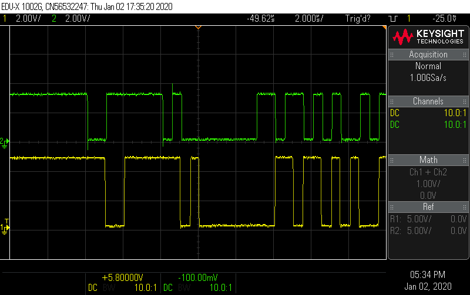

# DSMR-Fluvius S1 port simulator

TOC:

1. Why ?
2. Intro
3. Concept
4. Use
5. References

**Remark** this repo is only for ESP32 simulator. For ESP-S1 receiver see other repo!


## 1 Why ?

The S1 port of a smart meter in 'production' sends messages at **2Mbps** of **real** measurements.

For testing or debugging applications that read those S1 telegrams it would be nice to:

- control the speed of the telegrams
- control the content of the fields of the telegrams.

Since a 'ESP32' microcontroller would be the perfect candidate for **reading** the S1 messages, it made sense to also use it to make a **'Smart meter S1 simulator'**

## 2 Intro

### 2.1 S1 Interface

- RS422: is a 'balanced signal (+ & -) with same voltage levels as RS 485. The difference with RS485 is that it is not a 'bus' with addressable devices like RS485, but only for 'point to point'. Advandage is that we can use a standard RS485 level converter like [RS485 module](https://nl.aliexpress.com/item/32682660246.html?spm=a2g0s.9042311.0.0.1cde4c4dELnNA3)
- RJ12
  
- S1 Protocol : HDLC. Only the message format of HDLC is used. This simply comes down to the fact that every telegram starts and stops with **0x0F**, AKA 'tilde' **~**. Practically we don't even need a specific 'HDLC' arduino library! We can avoid all of this and just make sure that every 'telegram' starts and stops with a tilde.(0x0F)

### 2.2 S1 telegram - Key figures

- 52 samples per 50Hz cycle.
- Sampling rate = 2600 Hz.
- Telegram = 45 bytes of info
  - communication uses 8N1 = 1 start bit + 8 (info) bits + 1 stop bit = 10 bits / field
  - telegram = 45 bytes x 10 bits = 450 bits
  - Bitrate (fixed) = 2Mbps
    - 1 bit = 1 / 2Mbps = 0.5 us
    - telegram = 450 x 0.5us = 225 us.
  - Telegram - rate:
    - Fsampling = 2600 Hz
    - 1 telegram each 1/2600Hz = 384 us
- Telegram message definition (see all details pag 10 - 16)

**Telegram Defenition Summary**

```
E-MUCS Frame
 *  Flag          = 1 byte
 *  Frame Format  = 2 bytes
 *  Address Field = 1 byte
 *  Control Field = 1 byte
 *  Data          = 37 bytes
 *  CRC           = 2 bytes
 *  Flag          = 1 byte
```

**Details**

```
/*E-MUCS Frame = 45 bytes
 *  Flag          = 1 byte = 0x7E
 *  Frame Format  = 2 bytes = Frame Type (byte 1=0x80) + Frame Lenght (byte 2 = fixed = 0x2B = 43 bytes
 *  Address Field = 1 byte = broadcast to all stations = 0xFF
 *  Control Field = 1 byte = 0x03
 *  Data          = 37 bytes
 *      Meter ID        = byte 6 to 19
 *      Additional Info = byte 20
 *        bit 0 = meter type (0 = single fase 1 = 3 fase)
 *        bit 1 = sampling type (per sec = O , per period =1)
 *        bit 2 = (3-wire = 0 , 4 wire = 1) only when 3 fase
 *        bit 3 = samples ok ( 0=corrupted, 1 = ok)
 *        bit 4 = neutral current measured ( 0=no, 1=yes)
 *        bit 5-7 = Dataformat version (default '000')
 *     Sampling freq = byte 21
 *        if fixed per second = multiples of 100hz
 *        if per period = number of samples for 1 period (can vary)
 *     Network freq = byte 22-23 = uInt in mHz (0xC3 0xBB = 50.096 Hz)
 *     Frame Seq Nr = byte 24
 *     Voltage L1 = byte 25-26 in 25 mV
 *        Voltage L1-MSB = byte 25
 *        Voltage L1-LSB = byte 26
 *     Current L1 = byte 27-29
 *        Current L1-MSB = byte 27
 *        Current L1     = byte 28
 *        Current L1-LSB = byte 29
 *     Voltage L2 = byte 30-31
 *     Current L2 = byte 32-34
 *     Voltage L3 = byte 35-36
 *     Current L3 = byte 37-39
 *     Current N  = byte 40-42
 *     FCS        = byte 43-44
 *        FCS-LSB = byte 43
 *        FCS-MSB = 44
 *    Flag (Closing)  = 1 byte
 */
```

### 2.3 components

- [esp32](https://nl.aliexpress.com/item/32799253567.html?spm=a2g0s.9042311.0.0.27424c4d9gviD9)
- [RS485 module](https://nl.aliexpress.com/item/32682660246.html?spm=a2g0s.9042311.0.0.1cde4c4dELnNA3) Not needed for this simulator!

## 3 Concept

### 3.1 The physical aspect - "Layer 1 of the OSI model"

UART = Universal Asynchronous Receiver Decoder

- Hardware UART of ESP32 is used. Not SofwareSerial because of performance!
  - ESP32 has 3 hardware UARTs (0/1/2)
    - Serial0 is for interface communication with PC and arduino IDE
    - Serial1 or Serial2 can be used - we use Serial1
      - RX and TX can be defined:
        - TX = PIN 17
        - RX = PIN 16 - not needed for SM simulator - only when decoding
      - baudrate = 2000000 = 2Mbps
      - 8N1 = 8 bit - no parity bit used - 1 stop bit
        - remark: 1 start bit = defacto needed.

### 3.2 Protocol

Note:

- green = ESP S1 simulator
- yellow = S1 Fluvius smart meter in production

Timing between telegrams: 384 us.

Start byte **~**: (see under)

- Start bit: 'high to low' and takes 0.5us (start @second division for green)
- message **'start FLAG'** = 0xOF = '01111110'
- stop bit: 'low to high' and takes 0.5us



## 4 Use

Arduino source file can be changed to modify:

The standard [source file]("https://github.com/tribp/DSMR-Fluvius-S1-port-simulator/blob/master/src/esp32_DSMR_S1_tx.ino") sends a 'perfect 50Hz - 230V RMS - sinewave' with a 'real-life' smart meter interval at 384us.

### Modifing timing between telegrams

- Change **'TELEGRAMTIME'**:
  - use 370000 to simulate 'real' smart meter
  - use 20000000000 to send 1 telegram every 2 sec - eg for debugging your app.
  - use 20000000 to send 1 telegram every 20 ms -eg for total cycle - 52 samples debug.

### Modifying 50 hz signal.

- Change **signal**
  - standard = 1 perfect sinewave at 50Hz
  - you can manually modify:
    - Vp : amplitude of sinewave (remember this is in '25mv' increments!)
      - standard: 13010 (25mv) = 13010 x 25mV = 325250 mV = 325,25 V = SQRT(2) x 230V RMS.
    - add harmonics to test your DFT-frequency analysis at the receiver.
    - fix voltage values (V = byte 25-26) or (I = byte 27-29) to test receiver decoder functionality. This in order to check if values are conform example page 16 of eMUCS standard.

## 5 References.

Info only usefull when modifying TX signal in order to know what DFT will result at receiver.

- [An Intuitive Discrete Fourier Transform Tutorial](http://practicalcryptography.com/miscellaneous/machine-learning/intuitive-guide-discrete-fourier-transform/)
- [DSMR-Fluvius-S1-Reader]() todo
